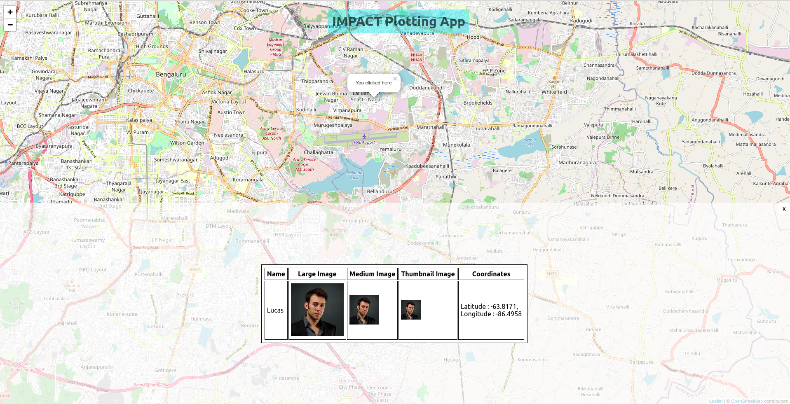

# IMPACT Plotting App (demo-app)

> NOTE: project bootstrapped with create-react-app so you can use its command to start/build project.

## Tech Stack
- React
- Typescript
- SCSS
- LeafLet
- React-Table

## Functionality
- Display map with given center point
- Clicking any point should slide-in panel from bottom
- Load clicked coordinate data asynchronously

## Demo

## Screenshot

